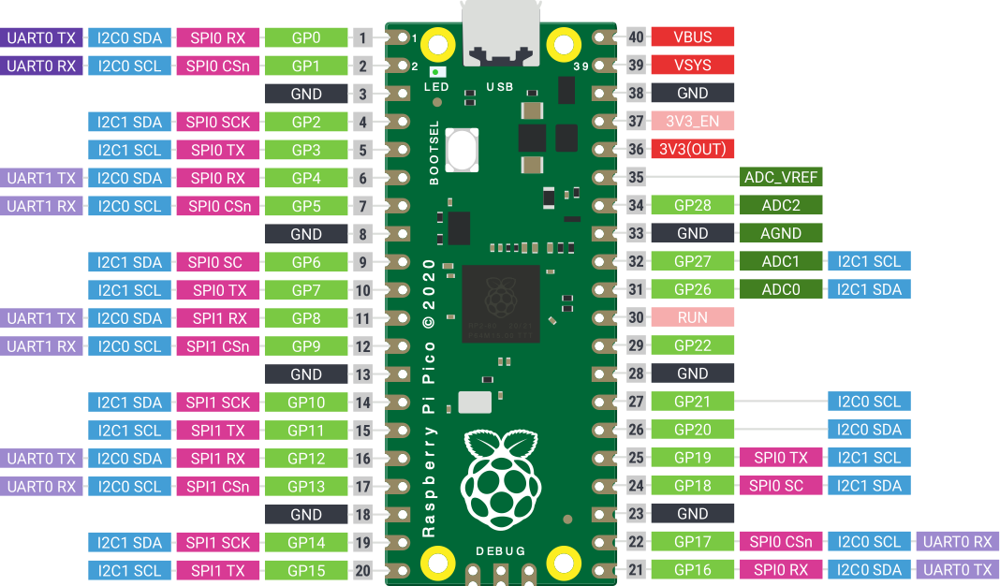

# Hardware – Stückliste und Bezug

Alle Angaben pro **Arbeitsplatz** (1 Arbeitsplatz = 1–2 Schüler:innen).
Ein Klassensatz für ca. 15 Arbeitsplätze ist für eine Projektwoche sinnvoll.

---

## Basis-Set (Pflicht für Lektion 01–04)

| Bauteil | Menge | Bemerkung |
|---------|-------|-----------|
| Raspberry Pi Pico H | 1 | **„H"-Variante** mit bereits verlöteten Stiftleisten |
| USB-Kabel (Micro-USB, Datenkabel!) | 1 | Mindestens 1 m, **nicht** nur Ladekabel |
| Breadboard (halbgroß, 400 Kontakte) | 1 | |
| Jumperkabel Male-Male | 20 | |
| Jumperkabel Male-Female | 10 | für direkte Sensor-Verbindungen |
| LED 5 mm (rot, grün, gelb) | je 2 | |
| Vorwiderstand 220 Ω | 5 | für LEDs |
| Vorwiderstand 10 kΩ | 3 | für Fotowiderstand und Taster |
| Taster / Mikroschalter | 3 | |
| Potentiometer 10 kΩ | 1 | linear |

## Erweiterung (Pflicht für Lektion 03–06)

| Bauteil | Menge | Bemerkung |
|---------|-------|-----------|
| OLED-Display SSD1306 128×64 (I²C) | 1 | I²C-Adresse meist 0x3C |
| Piezo-Buzzer (aktiv **oder** passiv) | 1 | passiv = eigene Frequenz per PWM einstellbar |
| DHT11 Temperatur-/Feuchtesensor | 1 | 3-Pin-Modul (mit Widerstand auf dem Modul) |
| Fotowiderstand (LDR, z.B. GL5528) | 1 | |

## Optional / Bonus

| Bauteil | Zweck |
|---------|-------|
| LCD 16×2 mit I²C-Adapter | Alternative zum OLED (Legacy-Skripte) |
| RGB-LED (Common Cathode) | Farbmischung-Projekte |
| Mini-Servo SG90 | bewegliche Projekte (Ampel, Barriere) |
| Raspberry Pi Pico W | Wenn WLAN benötigt wird (Bonus) |

---

## Bezugsquellen (Stand 2026)

| Shop | Vorteil |
|------|---------|
| **berrybase.de** | Gute Einzelteile, schnelle Lieferung, Rechnung für Schulen |
| **reichelt.de** | Günstig bei größeren Stückzahlen |
| **exp-tech.de** | Komplette "Maker-Kits" als Paket |
| **welectron.com** | Günstige Klassensätze Pico + Breadboard |
| **eBay / AliExpress** | Nur als Backup – längere Lieferzeiten, variable Qualität |

### Beispiel-Kit (Berrybase-ähnlich)
Viele Händler verkaufen **"Pico Starter Kits"** für ca. 25–35 €, die das
komplette Basis-Set plus OLED + Buzzer + DHT11 bereits enthalten. Für eine
Projektwoche rechnen sich diese Kits.

---

## Raspberry Pi Pico H – Pinout

Die in den Lektionen verwendeten Pins:

| Verwendung | GPIO | Pin am Board |
|------------|------|--------------|
| Interne LED | GPIO 25 | (on-board) |
| Externe LED (Beispiel) | GPIO 15 | Pin 20 |
| Taster (Beispiel) | GPIO 14 | Pin 19 |
| Buzzer (PWM) | GPIO 15 | Pin 20 |
| Potentiometer (ADC0) | GPIO 26 | Pin 31 |
| Fotowiderstand (ADC2) | GPIO 28 | Pin 34 |
| I²C0 SDA (OLED/LCD) | GPIO 16 | Pin 21 |
| I²C0 SCL (OLED/LCD) | GPIO 17 | Pin 22 |
| DHT11 Signal | GPIO 13 | Pin 17 |
| 3V3 out | — | Pin 36 |
| GND (mehrere verfügbar) | — | Pin 3, 8, 13, 18, 23, 28, 33, 38 |
